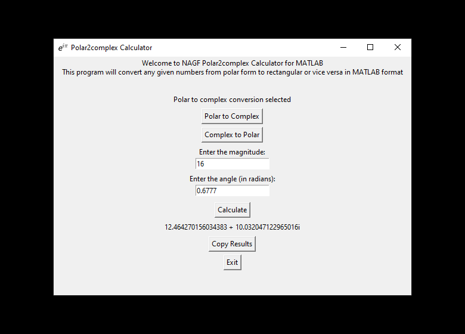

# NAGF Polar2complex Calculator

Simple complex numbers calculator that transform any given number between its polar and rectangular forms. Built in Python 3.10.8 using tkinter & pyperclip libraries.

The calculator is intended to be used by Matlab users. It returns the results in MATLAB format for easy implementation.

This software was developed as an engineering programming excercise to practice tkinter librarie for graphic user interface applications. It also works!

The repository includes:
* Source code of the software.
* Screenshots of the software running on Windows 10.

Standalone executable can be found inside the .zip folder: https://drive.google.com/file/d/1VAzgZ9mIq_aXA-dTnTjCxnfdqe_iPvyA/
